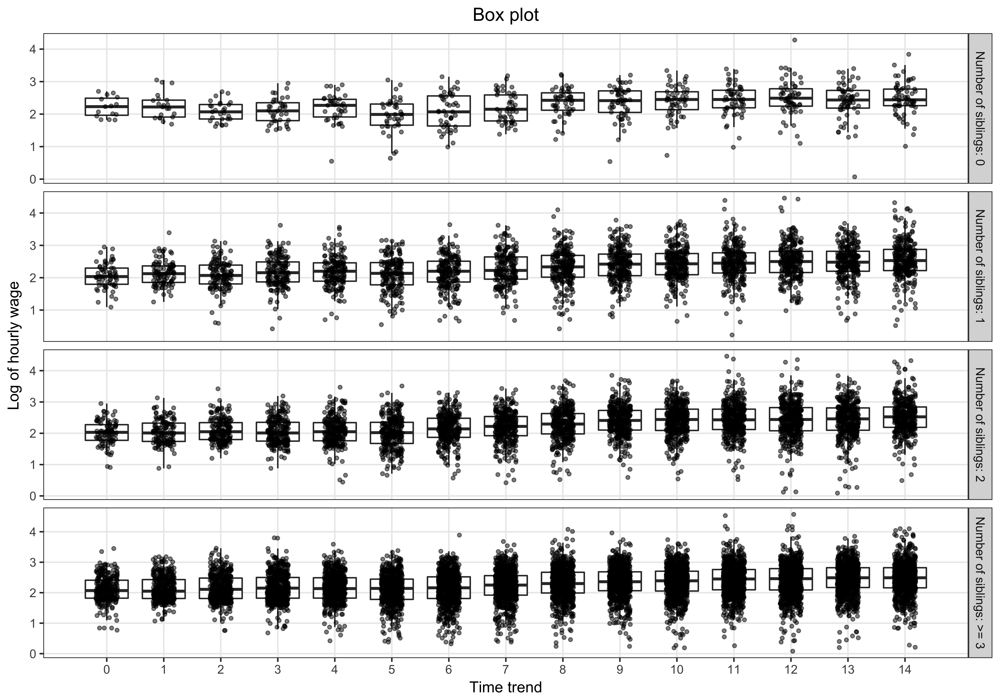

# CommonPlots

Overview
--------

CommonPlots is a package that allows the user to easily create a wide range of plots commonly used in statistical analysis in [ggplot2](http://ggplot2.org/) style.

Installation
------------
```r
# Install from GitHub:
# install.packages("devtools")
devtools::install_github("statech/CommonPlots")
```

Usage
-----

Most of the plots supported in CommonPlots can be easily created through one function call. The created plot function can be further customized to meet specific needs with [ggplot2](http://ggplot2.org/) functions.

#### Barplot

```r
library(CommonPlots)
gg_barplot(mpg, var = 'class', group = 'cyl', add_counts = FALSE)
```


#### Gantt Chart

```r
test_df <- data.frame(
    project = rep(paste('Project', 1:10), each = 2),
    time = c(rbind(sample(1:5, 10, replace = TRUE),
                   sample(6:8, 10, replace = TRUE))),
    status = factor(c(rbind(rep('start', 10),
                            c(rep('end', 5), rep('ongoing', 5)))),
                    levels = c('start', 'ongoing', 'end'))
)
gg_gantt_chart(test_df, var = 'project', time = 'time',
               status = 'status', grids = 'y')
```


#### Time-profiling graphs

##### Mean + SE plot
```r
data(koopLME)

# Mean + SE plot
data <- koopLME
data$siblings <- factor(with(data, ifelse(SIBLINGS >= 3, '>= 3', SIBLINGS)),
                        levels = c(0, 1, 2, '>= 3'))
mean_se_plot <- gg_time_profiling(
    data, x = 'TIMETRND', y = 'LOGWAGE', group = 'siblings',
    geoms = c('sumline'), avg_method = 'mean',
    var_method = 'se', x_lab = 'Time trend',
    y_lab = 'Log of hourly wage', group_lab = 'Number of siblings',
    title = 'Mean + SE plot'
)
```


##### Boxplot
```r
# Box plot over time
data <- koopLME
data$siblings <- factor(with(data, ifelse(SIBLINGS >= 3, '>= 3', SIBLINGS)),
                        levels = c(0, 1, 2, '>= 3'))
sib_labels <- paste('Number of siblings:', levels(data$siblings))
boxplot_time <- gg_time_profiling(
    data, x = 'TIMETRND', y = 'LOGWAGE', facet_r = 'siblings',
    facet_r_levels = setNames(levels(data$siblings), sib_labels),
    geoms = c('boxplot', 'point'), x_lab = 'Time trend',
    y_lab = 'Log of hourly wage', title = 'Box plot',
    sample_size = FALSE, all_xticks = TRUE
)
```


##### Spaghetti plot
```r
# Spaghetti plot
data <- koopLME
data <- with(data, data[PERSONID %in% unique(PERSONID)[1:100], ])
spaghetti_plot <- gg_time_profiling(
    data, x = 'TIMETRND', y = 'LOGWAGE', subject = 'PERSONID',
    geoms = c('line'), x_lab = 'Time trend',
    y_lab = 'Log of hourly wage', title = 'Spaghetti plot',
    subject_show = TRUE
)
```


##### Box plot
```r
data <- mpg
data$cyl <- factor(data$cyl)

# boxplot with Student's t-Test performed on engine displacement against year
boxplot_ <- gg_boxplot(
    data, x = 'cyl', y = 'displ', group = 'year', test_func = t.test,
    test_result = c('T test p value:' = 'p.value'),
    x_lab = 'Number of cylinders', y_lab = 'Engine displacement (L)',
    group_lab = 'Year', title = ''
)
```


Getting help
------------

The help page of CommonPlot package can be accessed by `help(package = 'CommonPlots')`. Most of the functions are documented and examples are provided to ease learning.


Contact
-------

If you have any questions or encounter any bugs, please contact the author (Feiyang Niu, Feiyang.Niu@gilead.com)
